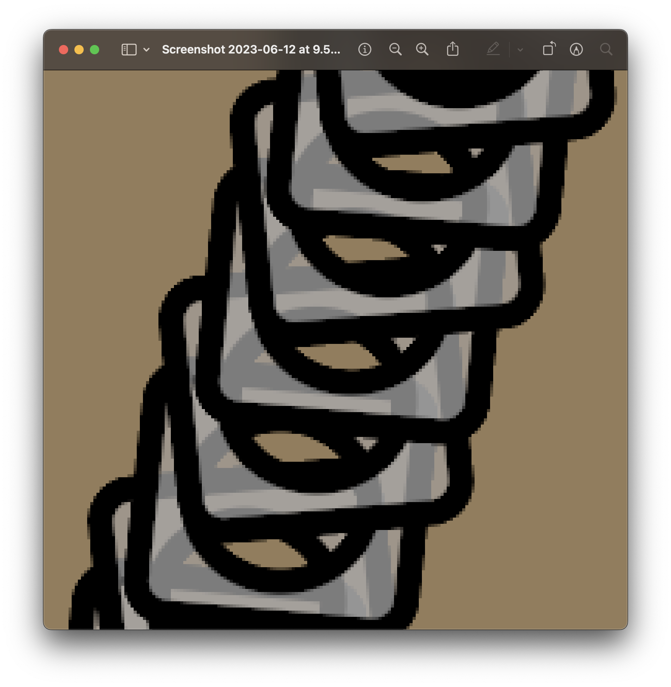
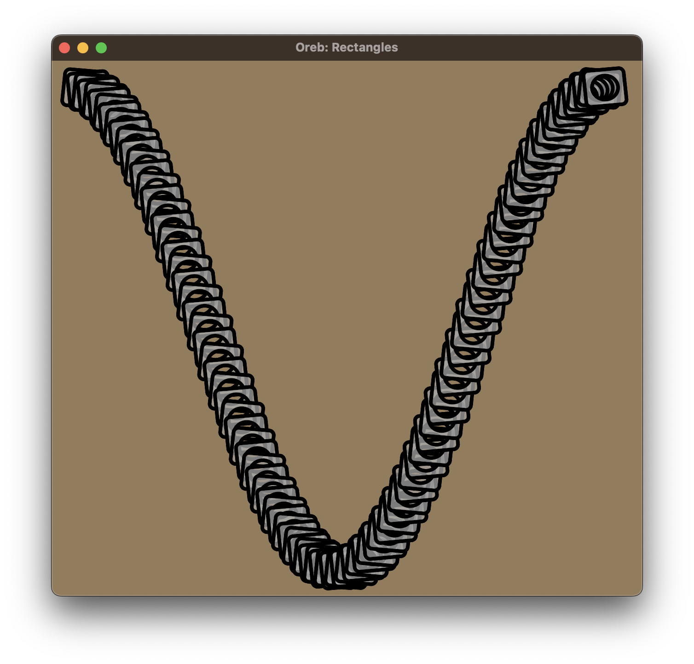

# Oreb

Exploring data visualization with wgpu.

## Gallery

### Rectangles and circles via SDFs

| Zoomed in  | Full scene |
| ---------- | ---------- |
|   |   |

- Still have a problem with the aspect ratio of the circles; have to use an
  ellipse and that still isn't perfect. Maybe need to control aspect ratio
  of triangles in viewport space - but I'm still confused about this.
- Using gradient to calculate viewport space line-widths that are robust to
  rotations. Feels good. I also get antialiased edges.

## Things to explore

- Use staging utility. Does it give more automatic memory management? How does
  it work?
- try on different targets
- hold down space to record a gif
- compute shaders, especially for geometry encoding
- click to zoom
